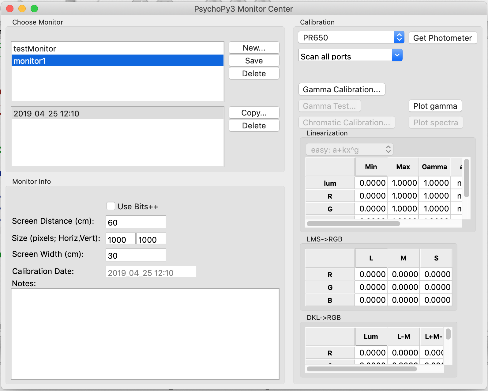
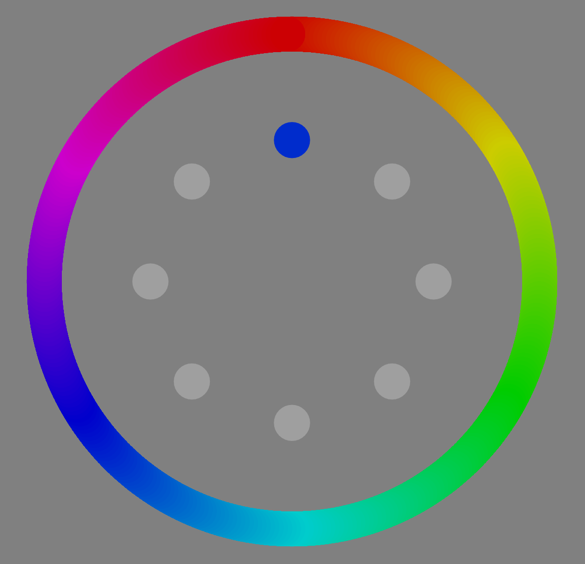

```{r setup, include=FALSE}
knitr::opts_chunk$set(echo = T)
library(reticulate)
use_python("/Users/stephenrhodes/anaconda3/bin/python")
```

## Psychopy

https://www.psychopy.org/

Peirce et al. (2019). PsychoPy2: Experiments in behavior made easy. *Behavior Research Methods, 51*, 195-203. https://link.springer.com/article/10.3758%2Fs13428-018-01193-y

Manual: https://www.psychopy.org/PsychoPyManual.pdf

## Installation

PsychoPy3 standalone app: https://github.com/psychopy/psychopy/releases

The app comes with two 'views'. The `builder` and the `coder` - we'll just be using the coder view. For advice on how to use the builder, see https://www.psychopy.org/builder/builder.html

If you want to use from the command line: https://www.psychopy.org/download.html#conda

## Why use psychopy?

- It's **free!!!**
- Scripts are easily shared (e.g. on osf, github)
- Coding experiments from scratch gives more flexibility
- Write data to non-proprietary format (no more copy-pasting, e-merge) in a format ready to be analyzed
- Lots of advice online: https://discourse.psychopy.org/
- Actively being developed with new features being added constantly (e.g., online experiments https://www.psychopy.org/online/index.html)

# psychopy modules + objects

## `visual`

This is the module I use most often

```{python, eval=F}

from psychopy import visual

win = visual.Window(size=[800,800], units='pix', color=[0,0,0])

```

Note that the default `colorSpace` is 'rgb' where the values range from -1 to 1

`win.colorSpace = 'rgb255'` would change the color space so that values range from 0 to 255


## `visual`

As a default all objects inherit the unit of the window. To specify size in degrees of visual angle we need to specify the dimensions of the monitor. This can be done via `Tools --> Monitor Center`. Then add `monitor = 'monitor1'` to `visual.Window` call

{width=600px}

## `visual + monitors`

Alternatively,

```{python, eval=F}

from psychopy import visual, monitors

WINSIZE = [1000, 1000] # in pixels
WIDTH = 30 # in cm
DIST = 60 # in cm

mon = monitors.Monitor("monitor1", width=WIDTH, distance=DIST)
mon.setSizePix(WINSIZE)
mon.save()

win = visual.Window(WINSIZE, units = 'deg', fullScr=True, monitor=mon)

```

## `visual`

```{python, eval=F}
# text 
txt = visual.TextStim(win, text="Some text", color=[-1,-1,-1], pos=[0,0], height=1)
# image
ima = visual.ImageStim(win, image="stimuli/images/PICTURE_1.png", pos=[0, 0])
# rectangle
rect = visual.Rect(win, pos=[0,0], width=1, height=1, 
    lineColor=[1,-1,-1], fillColor=[1,-1,-1])
# circle
circ = visual.Circle(win, pos=[0,0], radius=2)
# other shapes
shape = visual.ShapeStim(win, vertices=((-0.5, 0), (0, 0.5), (0.5, 0)))
# gabor
gabor = visual.GratingStim(win, tex="sin", mask="gauss", texRes=256, 
    size=[1.0, 1.0], sf=4)
```

Loads more examples `Demos --> stimuli` (e.g., `shapes.py`)


## `visual`

Many attributes of objects can be changed dynamically

```{python, eval=F}

txt.setText("New text") # older way of doing things
txt.text = "More new text" # ‘stim.attribute = value’ is replacing the above

gabor.ori = 90 # change orientation of gabor

ima.image = "stimuli/images/PICTURE_15.png"

circ.radius = 5 # increase circle radius

rect.fillColor = [-1,-1,1] # change color to blue

```

## `visual`

To present stimuli we first need to `draw` them, then `flip` the window to present

```{python, eval=F}

# present text item for 1 s
txt.draw()
win.flip()
core.wait(1) # we'll cover core soon...

```

## `core`

```{python, eval=F}

from psychopy import core

RT = core.Clock()
RT.reset()
# get response
response_time = RT.getTime()

core.wait(2)

core.quit() # close experiment

```

## timing in psychopy

https://www.psychopy.org/general/timing/timing.html

```{python, eval=F}

txt.draw()
win.flip()
core.wait(1)

# is less accurate than
frame_rate = 60 # Hz
for frame in range(frame_rate):
    txt.draw()
    win.flip() # flip the window frame_rate times to present for 1 s

```

Because I'm lazy, all of the example scripts use `core.wait` but presentation times will be off using this method (could be a big deal if you need to sync timings with an external device). See `Demos --> timing --> timeByFrames.py`

[Here](https://github.com/stephenrho/Guessing/tree/master/materials) are example change detection tasks that time by frames

## `event`

Functions for getting responses

```{python, eval=F}

key = event.waitKeys(maxWait = 10) # waits for a keypress (returns list)
key = event.getKeys(keyList=["space", "escape"]) # gets recently pressed keys

mouse = event.Mouse(win) # can be used to track mouse position + clicks
mouse.getPos()

event.clearEvents() # resets things (can specify eventType)

```

## Other modules

```{python, eval=F}

from psychopy import gui # for getting participant information

from psychopy import data 
# data has functions for handling conditions + saving data
# which might be useful for you but I don't use often

# create a GUI to get participant number, gender, age, and set date
expInfo = {'Participant': 1, 'Gender': ['M', 'F', "O"], 'Age': 18}
expInfo['dateStr'] = data.getDateStr()

dlg = gui.DlgFromDict(expInfo, title = "Basic Information", 
    fixed = ['dateStr'], order=['Participant', 'Age', 'Gender'])
if not dlg.OK:
    core.quit()

```


## How I normally structure scripts

1. `import` modules
2. Specify some settings for variables I might want to change later on
3. Create the `psychopy` objects needed to run the experiment
4. Define functions used in the task(s)
5. Define the `main` experiment function that brings everything together

# An example

## An example

We'll go through `examples/recognition.py` in detail

This implements a simple word recognition experiment where participants make an old-new judgement and then rate confidence

## Importing modules

```{python, eval=F}
from psychopy import visual, monitors, core, data, event, gui
import random, os, csv
import pandas as pd
```

## Defining settings

```{python, eval=F}
### SETTINGS
WINSIZE = [1000, 1000] # window size in pixels
WIDTH = 30 # in cm (used to define monitor settings)
DIST = 60 # in cm
BACKGROUND=[0,0,0] # color in 'rgb' space
FOREGROUND=[-1,-1,-1]
QUIT="escape" # a key we can use to exit the experiment at certain points
```

## Create psychopy objects

```{python, eval=F}
### CREATE PSYCHOPY OBJECTS
mon = monitors.Monitor("monitor1", width=WIDTH, distance=DIST)
mon.setSizePix(WINSIZE)
mon.save()

win = visual.Window(WINSIZE, units = 'deg', allowGUI=False, fullScr=True, 
    color=BACKGROUND, monitor=mon)

text_stim = visual.TextStim(win, color=FOREGROUND, pos=[0,0], height=1, wrapWidth=25)
conf_scale = visual.RatingScale(win, low=1, high=3, singleClick=True, showAccept=False,
    labels=('Low','Med','High'), scale='How confident are you?', pos=[0,0])

RT = core.Clock()
```

## GUI

This appears here as information from the GUI is used to determine the list seen by the participant

```{python, eval=F}
### GUI FOR GETTING PARTICIPANT INFO
expInfo = {'Participant' : 1, 'List': [1, 2], 'Age' : 18}
expInfo['dateStr'] = data.getDateStr()

dlg = gui.DlgFromDict(expInfo, title = "Basic Information", fixed = ['dateStr'], order=['Participant', 'List', 'Age'])
if not dlg.OK:
    core.quit()

save_path = "recognition-data/" # create a folder for the data files
if not os.path.exists(save_path):
    os.makedirs(save_path)
```

## Setting up stimuli + conditions

In the `examples/stimuli` folder there are 4 csv files that contain pre-determined lists: 2 study, 2 test. Half of the items serve as old targets in one list and serve as new lures in the other list

```{python, eval=F}

### SET UP STIMULI AND CONDITIONS
a = csv.DictReader(open('stimuli/study_list%s.csv' % expInfo["List"]), delimiter=',')
study_list = [x for x in a] # unpack into a list of dictionaries

b = csv.DictReader(open('stimuli/test_list%s.csv' % expInfo["List"]), delimiter=',')
test_list = [x for x in b]

```

```
print(study_list)
[{'num': '1', 'word': 'plenty'}, {'num': '2', 'word': 'lots'}, 
{'num': '3', 'word': 'tear'}, {'num': '4', 'word': 'food'}, 
{'num': '5', 'word': 'speech'}, {'num': '6', 'word': 'body'}, 
{'num': '7', 'word': 'clock'} ... 
```

## Setting up stimuli + conditions

Or we can randomize what words are old and new for each participant

```{python, eval=F}
def read_words(file):
    f = open(file, 'r')
    x = f.readlines()
    x = [i.replace('\n', '') for i in x]
    x = [i.replace('\r', '') for i in x]
    return(x)
all_words = read_words(file="stimuli/words.txt")

study_words = random.sample(all_words, len(all_words)/2)
study_list = [{"word": i} for i in study_words]

test_list = []
for i in range(len(all_words)):
    if all_words[i] in study_words:
        test_list.append({"num": i+1, "word": all_words[i], "item_old": 1})
    else:
        test_list.append({"num": i+1, "word": all_words[i], "item_old": 0})
```


## Functions used in task

```{python, eval=F}
### FUNCTIONS USED IN THE EXPERIMENT
def press_key(text = 'Press SPACE to continue', k_list = ['space']):
    text_stim.text = text
    text_stim.draw()
    win.flip()
    k_list.append(QUIT)
    key = event.waitKeys(keyList = k_list)[0]
    if key == QUIT:
        core.quit()
    else:
        return(key)
```

Wait for a keypress while presenting some text. Allow the QUIT key to be pressed to exit experiment


## Functions used in task

```{python, eval=F}
def study_proc(study_list, pres_time = 2, isi = .5):
    win.flip()
    core.wait(1)
    for item in study_list:
        text_stim.text = item["word"].upper()
        text_stim.draw()
        win.flip() # present the word for the presentation time
        core.wait(pres_time)

        text_stim.text = "+"
        text_stim.draw()
        win.flip() # present a fixation cross for the isi
        core.wait(isi)
```

At study, loop through the items in the study_list

## Functions used in task

```{python, eval=F}
def test_proc(test_list):
    press_key("'O' = old\n'N' = new\n\nPress SPACE to start")
    # loop through the test list
    for item in test_list:
        text_stim.text = item["word"].upper()
        text_stim.draw()
        win.flip() # present probe word

        RT.reset() # start counting for RT
        resp = event.waitKeys(keyList=["o", "n", QUIT])[0] # returns a list, we just want the first element
        if resp == QUIT:
            core.quit()
        resp_rt = RT.getTime() # response has been made
        
        ... # continued on next slide
```

## Functions used in task

`test_proc` continued...

```{python, eval=F}
        while conf_scale.noResponse: # get the confidence rating
            conf_scale.draw()
            win.flip()

        conf = conf_scale.getRating()
        conf_rt = conf_scale.getRT()
        conf_scale.reset()

        win.flip()
        core.wait(.5) # blank interval after response
        
        ... # continued on next slide
```

## Functions used in task

`test_proc` continued...

```{python, eval=F}
        if resp == "o": # did the participant respond "old"?
            resp_old = 1
        else:
            resp_old = 0

        # add data to the dictionary
        item["resp"] = resp
        item["resp_old"] = resp_old
        item["resp_rt"] = resp_rt
        item["conf"] = conf
        item["conf_rt"] = conf_rt

    return(test_list)
```

## Main experiment function

```{python, eval=F}
### MAIN EXPERIMENT FUNCTION
def main():
    press_key("Remember these words.\n\nLater on you'll be asked to identify these 
        words among new words.\n\nPress SPACE to begin...")
    # present study list
    study_proc(study_list)

    press_key("Now we will test your memory for the words you just saw. You'll see 
        words one at a time. For each decide whether it is old (just studied) or new 
        (not studied).\n\nPress SPACE to continue...")
    # present test
    test_data = test_proc(test_list)
    
    ... # continued on next slide
```

## Main experiment function

`main` continued...

```{python, eval=F}

    # convert to a data frame and add some columns
    test_data_pd = pd.DataFrame(test_data)
    test_data_pd["pid"] = expInfo["Participant"]
    test_data_pd["list"] = expInfo["List"]
    test_data_pd["age"] = expInfo["Age"]

    # use pandas to write data to csv file
    test_data_pd.to_csv(save_path + "p" + str(expInfo["Participant"]) + "_" +
        expInfo["dateStr"] + ".csv")

```

## Writing data

In the previous example we used `pandas` to write the data to csv in one line

Alternatively we can write data at the end of each trial. See `examples/color-wheel.py`

```{python, eval=F}

file_name = save_path + datestr + '.csv'
data_file = open(file_name, 'w') # open a file in 'write' mode
col_headers = "id, trial, serial_pos, location, presented, recalled, error\n"
data_file.write(col_headers)

... # other code goes here. See example

'''tdat = a dictionary containing the data for one trial where there are 4 responses'''
# write trial data to file
for i in range(4):
    data_file.write("%s, %i, %i, %i, %i, %i, %i \n" %(datestr, t+1, i+1,
        tdat["locations"][i], tdat["studied"][i], tdat["recalled"][i], tdat["errors"][i]))
```

# More examples | Let's scroll through some scripts together

## `cued-recall.py`  {.columns-2}

{width=400px}

Learn pairings of images and words

Demonstrates:

- text input
- giving feedback to participant
- pickling python objects with `pickle`

## `color-wheel.py`  {.columns-2}

{width=400px}

Recall colors on a color wheel

Demonstrates:

- tracking mouse position
- continuously updating stimuli
- importing from other scripts - `extras.py`
- writing data by line

## What we didn't cover

- trial handlers
- data, logging functions


